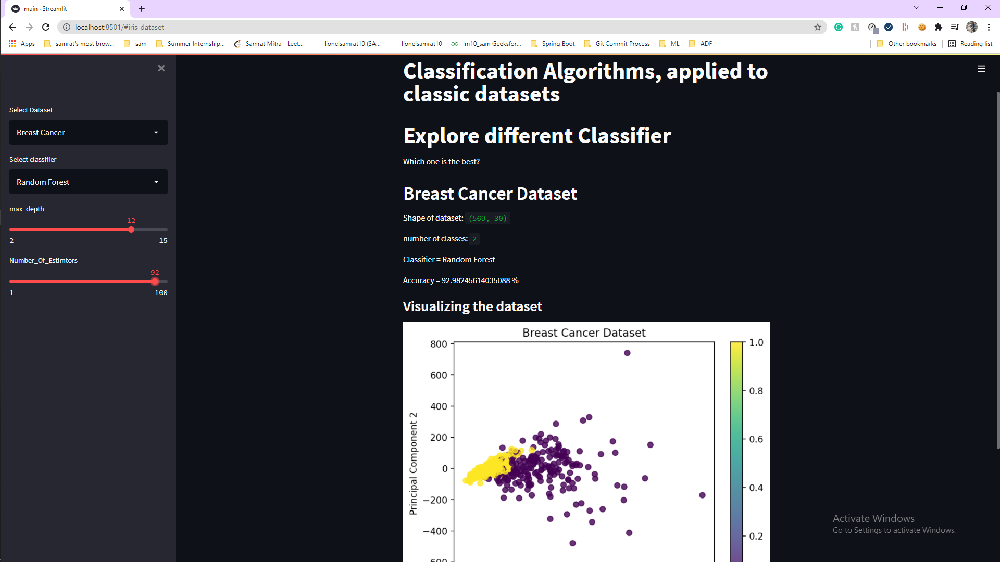

# Interactive Web App with Streamlit and Scikit-learn that applies different Classification algorithms to popular datasets

Datasets Used: Iris dataset, Breast Cancer Dataset and Wine Dataset from UC Irvine Machine Learning Repository

## Preview


## Installation
You need these dependencies:
```console
pip install streamlit
pip install scikit-learn
pip install matplotlib
```

## Usage
Clone the repository
```console
git clone https://github.com/lionelsamrat10/Classification-Visualization.git
```
Go to the project directory
```console
cd Classification-Visualization-main
```
Run
```console
streamlit run main.py
```
